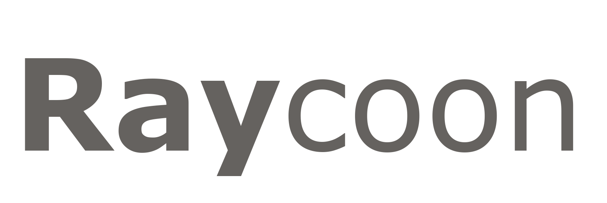

<p align="center">
  
  <br />
  
</p>

<br />

<p align="center">
    A minimal <b>raycasting engine</b> written in Rust.
</div>

<p align="center">
  <image src="./assets/docs/screen_one.png" width="300">
  <image src="./assets/docs/screen_two.png" width="300">
  <image src="./assets/docs/screen_three.png" width="300">
  <image src="./assets/docs/screen_four.png" width="300">
</div>

<br />
<br />

Raycoon is a small, modern, and educational **2.5D raycasting engine** inspired by classic FPS techniques.
It focuses on clarity, simplicity, and clean architecture: the core provides pure logic (raycasting, collisions, tile mapping), while rendering and input are handled externally.

> [!NOTE]
>
> - Developed in personal free time.
> - Educational side project.
> - Contributions welcome.

## ✨ Features
- Minimal DDA-based raycasting engine  
- Tile-based world with configurable blocking tiles  
- Per-axis collision handling  
- Strict separation between **engine** and **renderer**  
- Simple C-compatible FFI API for easy bindings
- Lightweight, hackable, and easy to understand

## 🧩 Engine Language Support

Raycoon’s core is written in **Rust**, with an official **FFI binding** available.

| Language | Support | Details |
|---------|---------|---------|
|  | ✔️ | Native engine implementation |
|  | ⚠️ | FFI-compatible (no official binding) |

## 📦 Installation
Add the crate to your project :

```toml
[dependencies]
raycoon = "x.x.x"
```

## ⚒️ Example

Run the bundled example :

```bash
cargo run --example basic
```

## 🤝 Contributing
Contributions are welcome!  
Please keep the engine strictly backend-agnostic.  
Rendering, input handling, and tooling must remain in external modules.

## 📜 License
MIT License.
